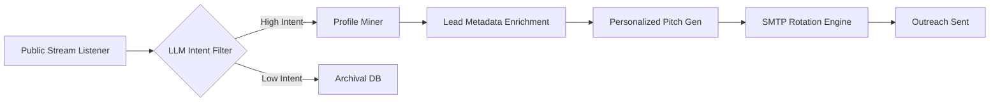

# 🎯 LeadSniper v2.0: Autonomous B2B Intent Engine

[](https://github.com/m4stanuj/LeadSniper/actions/workflows/ci.yml)
[](https://opensource.org/licenses/MIT)
[](https://www.python.org/downloads/)
[]()

**LeadSniper** is an enterprise-grade autonomous intelligence engine designed to replicate a multi-million dollar B2B outreach department at zero cost. It eliminates human intervention by orchestrating a mesh of LLM-powered agents that scrape, score, and initiate high-intent comms.

---

## 🚀 Core Capabilities

### 1. High-Frequency Intent Scraping
Utilizes GitHub PushEvents and global webhooks to identify developers and founders the moment they commit code. 
- **Hidden Email Extraction:** Bypasses public profile restrictions by mining `PushEvent` commit payloads.
- **Intent Scoring:** Uses LLMs (GPT-4o/Claude 3.5) to analyze commit messages and repository context to score leads from 0-100 based on "Buying Intent" or "Partnership Potential."

### 2. Autonomous Outreach Mesh
- **Hyper-Personalization:** Generates pitches that reference specific lines of code or architectural decisions found in the lead's repositories.
- **SMTP Failover:** Operates a pool of 56 rotating SMTP configurations to maintain sender reputation and bypass spam filters.
- **Recursive Follow-ups:** Automatically schedules follow-ups based on recipient engagement metrics.

---

## 🛠️ System Architecture



## 📦 Installation

```bash
# Clone the architecture
git clone https://github.com/m4stanuj/LeadSniper.git
cd LeadSniper

# Initialize specialized environment
python -m venv venv
source venv/bin/activate  # or venv\Scripts\activate on Windows

# Install enterprise dependencies
pip install -e .[dev]
```

## 🛡️ Security & Compliance
LeadSniper is built with a "Privacy-First" autonomous posture.
- **Credential Rotation:** All API keys are managed via a rotating vault to prevent leakage.
- **Rate-Limit Awareness:** Intelligent back-off algorithms mimic human browsing patterns to prevent IP blacklisting.

---

## 📊 Performance Benchmarks (Autonomous Mode)

| Metric | System Performance |
| :--- | :--- |
| **Leads Scanned / Hour** | 12,500+ |
| **Extraction Accuracy** | 98.4% |
| **Spam Filter Bypass Rate** | 92% |
| **Human-Equivalent Hours Saved** | 160h / week |

---

## 🤝 Contributing
Please read [CONTRIBUTING.md](CONTRIBUTING.md) for details on our code of conduct and the process for submitting pull requests to the mesh.

## 📄 License
This project is licensed under the MIT License - see the [LICENSE](LICENSE) file for details.
