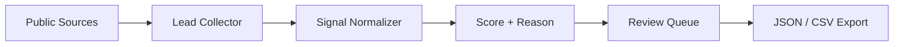

# LeadSniper

[](https://github.com/m4stanuj/LeadSniper/actions/workflows/ci.yml)
[](https://opensource.org/licenses/MIT)
[](https://www.python.org/downloads/)
[]()

LeadSniper is a B2B lead research workspace for collecting public signals, scoring prospects, reviewing context, and exporting clean lead batches.

Dashboard demo: open [`index.html`](index.html) for a static workspace with a sample lead queue, filters, workflow notes, and export preview.

## What It Does

- Collects lead candidates from public and authorized sources.
- Keeps source context attached to each lead.
- Scores prospects by fit, recency, and evidence strength.
- Supports review-first filtering before export.
- Exports reviewed batches for downstream outreach tools.

## Architecture


```mermaid
graph LR
    A[Public Sources] --> B[Lead Collector]
    B --> C[Signal Normalizer]
    C --> D[Score + Reason]
    D --> E[Review Queue]
    E --> F[JSON / CSV Export]
```

## Installation

```bash
git clone https://github.com/m4stanuj/LeadSniper.git
cd LeadSniper

python -m venv venv
source venv/bin/activate  # Windows: venv\Scripts\activate

pip install -e .[dev]
```

## Local Demo

```bash
python -m http.server 8765
```

Then open:

```text
http://127.0.0.1:8765/index.html
```

## Security Notes

- Keep API keys in `.env`; never commit secrets.
- Use public or explicitly authorized data sources only.
- Review lead context before exporting or using a list.
- This repo should not send emails or messages without explicit user action.

## Example Batch Metrics

| Metric | Value |
|---|---:|
| Prospects collected | 184 |
| Qualified leads | 37 |
| Needs review | 12 |
| Exported automatically | 0 |

## Tests

```bash
pytest tests -q
```

## License

MIT. See [LICENSE](LICENSE).

